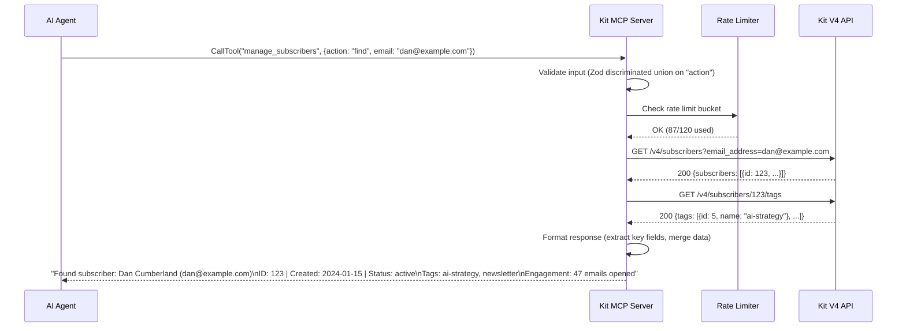
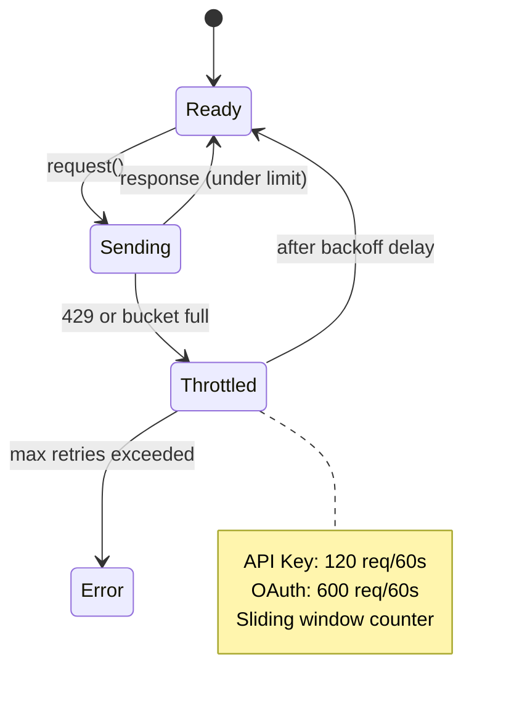

# Kit MCP Server — Product Requirements Document

## 1. Governance

- **Status**: Active
- **Priority**: High
- **Owner**: Dan Cumberland (@dancumberland)
- **Repository**: `github.com/dancumberland/kit-mcp` (to be created)
- **npm Package**: `@dancumberland/kit-mcp`
- **AI Instruction**: READ THIS SECTION FIRST. This PRD specifies an MCP server that wraps the Kit.com (formerly ConvertKit) V4 API. The server exposes 13 composite tools organized by resource area (not 1:1 API endpoint wrappers). Each tool uses a discriminated union `action` parameter to handle multiple operations. All tool responses are context-window friendly — formatted text summaries, never raw JSON dumps. The server runs locally via stdio transport.

---

## 2. Context & Objectives

### Problem

Kit.com (email marketing platform, 500K+ creators) has no official MCP integration. The one existing community server ([`kit-mcp-server`](https://www.npmjs.com/package/kit-mcp-server) on npm) has critical architectural problems:

| Problem | Impact |
|---------|--------|
| 29 thin 1:1 API wrapper tools | Context bloat — tool definitions alone consume ~6,000-8,700 tokens |
| Raw JSON dumps as output | Wastes context tokens on irrelevant fields (timestamps, metadata, nested objects) |
| Opaque HTTP error codes | Agent can't self-recover — requires human debugging |
| No rate limiting | Risk of 429 errors crashing agent workflows |
| ~50% Kit V4 API coverage | Missing operations force manual Kit UI work |
| `any` types throughout | No type safety, poor IDE support, silent failures |
| 5 smoke tests | No meaningful test coverage |

For AI agents managing email lists, broadcasts, and subscriber data, this means: wasted context tokens, cryptic failures, and incomplete coverage.

### Objective

Build a public, open-source MCP server for Kit.com that is:

1. **Agent-optimized** — 13 composite tools return formatted summaries, not raw API responses
2. **Complete** — covers 100% of the Kit V4 API surface across all 11 resource areas
3. **Robust** — built-in rate limiting, retry logic, typed errors with recovery suggestions
4. **Simple to install** — 3 steps, 8 lines of JSON, works via `npx`
5. **Context-efficient** — ~3,500 tokens of tool definitions vs ~8,000+ for competitor

### Why 13 Composite Tools (Not 45 Granular)

This architecture decision was validated through a formal advisory board deliberation with five systems engineering advisors. The key factors:

1. **Cursor hard-limits at 40 tools total** across all MCP servers. A 45-tool server would consume the entire budget from a single server, making it non-functional for Cursor users.

2. **Token math**: 45 tools × ~200 tokens/definition = 9,000-11,250 tokens of overhead before the agent processes a single user request. 13 composite tools = ~3,000-4,500 tokens. That's a 60-70% reduction.

3. **Agent selection accuracy**: Research shows accuracy drops from 92% at 5-7 tools to 60% at 50+ tools (Jenova AI). Hierarchical selection (pick resource → pick action) outperforms flat selection across a large list.

4. **Temporal asymmetry**: Starting with 13 tools and later splitting one into granular tools is backwards-compatible (additive). Starting with 45 and consolidating later is a breaking change that removes tool names users depend on. Always choose the design that keeps more futures open.

5. **Maintenance surface**: 13 public API contracts vs 45 for a solo maintainer. When Kit changes their API, composite tools absorb the change as a new action string — no external contract breaks.

6. **Silent failure prevention**: 45 tools create 990 pairwise confusion opportunities (n(n-1)/2). 13 tools create 78. Wrong tool selection from a flat list fails silently — the agent gets a result, just the wrong one. Wrong action within a composite tool can be validated and rejected with a clear error.

Full deliberation record: `Boardroom/260315-kit-mcp-tool-count/deliberation.md`

### Success Metrics

| Metric | Target | How Measured |
|--------|--------|--------------|
| Kit V4 API coverage | 100% of documented endpoints | Endpoint checklist in tests |
| Tool count | 13 (hard ceiling: 15) | `server.tool()` registrations |
| npm weekly downloads | >100 within 90 days | npm stats |
| GitHub stars | >25 within 90 days | GitHub |
| MCP Registry listed | Yes | registry.modelcontextprotocol.io |
| Context tokens per tool response | <500 avg (vs ~2,000 for competitor) | Benchmark test suite |
| Context tokens for tool definitions | <4,500 total (vs ~8,000+ for competitor) | Token counter |
| Setup time for new user | <5 minutes | User testing |

---

## 3. Tech Stack Constraints

```
Language:        TypeScript 5.6+
Runtime:         Node.js 22+ (LTS)
MCP SDK:         @modelcontextprotocol/sdk ^1.25
Validation:      Zod ^3.23 (tool input schemas — discriminated unions)
Transport:       stdio (local execution only)
Build:           tsup (ESM + CJS dual output, shebang injection)
Testing:         Vitest
Linting:         Biome
CI:              GitHub Actions
```

### Dependencies (Production)

| Package | Purpose |
|---------|---------|
| `@modelcontextprotocol/sdk` | MCP protocol implementation |
| `zod` | Runtime input validation — discriminated unions for action parameters |

### Dependencies (Dev)

| Package | Purpose |
|---------|---------|
| `typescript` | Type system |
| `tsup` | Build (ESM/CJS, shebang) |
| `vitest` | Testing |
| `biome` | Lint + format |

**No other production dependencies.** HTTP calls use Node's native `fetch`. No axios, got, or node-fetch.

---

## 4. Architecture

### Project Structure

```
kit-mcp/
├── src/
│   ├── index.ts              # Entry point (shebang, server bootstrap)
│   ├── server.ts             # MCP server setup, tool registration
│   ├── client.ts             # Kit API HTTP client (auth, rate limiting, retries)
│   ├── types.ts              # Shared TypeScript types
│   ├── formatters.ts         # Response formatters (raw JSON → agent-friendly text)
│   ├── tools/
│   │   ├── subscribers.ts    # manage_subscribers (9 endpoints)
│   │   ├── tags.ts           # manage_tags (6 endpoints + 3 bulk)
│   │   ├── broadcasts.ts     # manage_broadcasts (8 endpoints)
│   │   ├── forms.ts          # manage_forms (3 endpoints + 1 bulk)
│   │   ├── sequences.ts      # manage_sequences (3 endpoints)
│   │   ├── custom-fields.ts  # manage_custom_fields (4 endpoints + 2 bulk)
│   │   ├── purchases.ts      # manage_purchases (3 endpoints)
│   │   ├── segments.ts       # manage_segments (1 endpoint)
│   │   ├── webhooks.ts       # manage_webhooks (3 endpoints)
│   │   ├── email-templates.ts # manage_email_templates (1 endpoint)
│   │   ├── account.ts        # get_account (5 endpoints)
│   │   ├── bulk.ts           # bulk_operations (7 endpoints, OAuth only)
│   │   └── connection.ts     # test_connection (1 endpoint)
│   └── errors.ts             # Typed error classes with recovery hints
├── tests/
│   ├── unit/                 # Unit tests (formatters, client, tools, action dispatch)
│   └── integration/          # Integration tests (requires API key)
├── package.json
├── tsconfig.json
├── tsup.config.ts
├── biome.json
├── server.json               # MCP Registry metadata
├── LICENSE                   # MIT
└── README.md
```

### Composite Tool Architecture

Each tool file exports a single tool registration that handles multiple actions via discriminated union dispatch:

```
┌──────────────────────────────────────────────────────┐
│ Agent calls: manage_subscribers({action: "find", …}) │
└──────────────────────┬───────────────────────────────┘
                       │
        ┌──────────────▼──────────────┐
        │   Zod validates input       │
        │   (discriminated on action) │
        └──────────────┬──────────────┘
                       │
         ┌─────────────▼─────────────┐
         │  Action dispatcher routes  │
         │  to handler function       │
         └─────────────┬─────────────┘
                       │
          ┌────────────▼────────────┐
          │  Handler calls Kit API  │
          │  (may compose multiple  │
          │   endpoints)            │
          └────────────┬────────────┘
                       │
           ┌───────────▼───────────┐
           │  Formatter produces   │
           │  agent-friendly text  │
           └───────────┬───────────┘
                       │
            ┌──────────▼──────────┐
            │  Return MCP result  │
            │  {type: "text", …}  │
            └─────────────────────┘
```

### Sequence Diagram: Tool Invocation



### Rate Limiting Architecture



---

## 5. Tool Design Philosophy

### Principle: One Tool Per Resource, Not One Tool Per Endpoint

The existing `kit-mcp-server` exposes 29 tools as thin 1:1 API wrappers. An agent managing subscribers must discover and choose between `list_subscribers`, `get_subscriber`, `create_subscriber`, `update_subscriber`, etc. — all competing for attention in a flat tool list.

Our server groups related operations under a single tool per Kit resource area. The agent selects the resource (high-confidence coarse classification), then specifies the action (constrained enum within that resource's domain).

**Why this is better:**

| Dimension | Thin Wrappers (Competitor) | Composite Tools (Ours) |
|-----------|---------------------------|------------------------|
| Tool selection | Flat list of 29+ names | 13 resource-oriented names |
| Context overhead | ~8,000+ tokens | ~3,500 tokens |
| Agent accuracy | Degrades at 20+ tools | Stable at 13 tools |
| Discovery | Read 29 descriptions | Read 13 — each clearly maps to a Kit concept |
| Maintenance | 29 public contracts | 13 public contracts |
| Kit API changes | Potentially breaks tool name/schema | Absorbed as new action string |
| Cursor compatible | At risk (29 tools, limit is 40 total) | Safe (13 tools, plenty of room) |

### Action Parameter Pattern

Every composite tool accepts an `action` parameter as a required `z.enum`. The remaining parameters are validated per-action using Zod discriminated unions. This means:

- Invalid actions return a clear error: `"Invalid action 'lst' for manage_subscribers. Valid actions: find, list, create, update, unsubscribe, stats, filter"`
- Parameters for action `"create"` are validated differently from parameters for action `"find"`
- The tool description in MCP includes the action list, so agents can see available operations without calling the tool

### Example: Competitor vs. Us

**User request**: "Show me the subscriber dan@example.com and their tags"

**Competitor (`kit-mcp-server`)**:
```
Agent selects: list_subscribers (from 29 options)
Agent calls: list_subscribers({email_address: "dan@example.com"})
Response: 800+ tokens of raw JSON including pagination metadata, timestamps, nested objects
Agent must then call: list_tags_for_subscriber({subscriber_id: 123})
Response: Another 400+ tokens of raw JSON
Total: 2 tool calls, ~1,200 tokens of output
```

**Ours (`@dancumberland/kit-mcp`)**:
```
Agent selects: manage_subscribers (from 13 options)
Agent calls: manage_subscribers({action: "find", email: "dan@example.com"})
Response: "Found subscriber: Dan Cumberland (dan@example.com)
ID: 123 | Created: 2024-01-15 | Status: active
Tags: ai-strategy, newsletter
Engagement: 47 opens, 12 clicks, last active 2026-03-10"
Total: 1 tool call, ~80 tokens of output
```

### Tool Naming Convention

- Composite tools: `manage_{resource}` — lowercase, underscore-separated
- Standalone tools: `{verb}_{noun}` — for simple, single-purpose tools
- All tools prefixed in registration to avoid conflicts with other MCP servers

---

## 6. Complete Tool Inventory

### Overview

**13 tools** covering the entire Kit V4 API surface.

| # | Tool | Actions | Kit Endpoints | Auth |
|---|------|---------|---------------|------|
| 1 | `manage_subscribers` | 7 | 9 | API Key (bulk: OAuth) |
| 2 | `manage_tags` | 6 | 8 | API Key |
| 3 | `manage_broadcasts` | 6 | 8 | API Key |
| 4 | `manage_forms` | 3 | 4 | API Key |
| 5 | `manage_sequences` | 3 | 3 | API Key |
| 6 | `manage_custom_fields` | 4 | 4 | API Key |
| 7 | `manage_purchases` | 3 | 3 | OAuth |
| 8 | `manage_segments` | 1 | 1 | API Key |
| 9 | `manage_webhooks` | 3 | 3 | API Key |
| 10 | `manage_email_templates` | 1 | 1 | API Key |
| 11 | `get_account` | — | 5 | API Key |
| 12 | `test_connection` | — | 1 | API Key |
| 13 | `bulk_operations` | 7 | 7 | OAuth |

---

### 1. `manage_subscribers`

Manage your Kit subscriber list — find, list, create, update, unsubscribe, and analyze engagement.

| Action | Description | Kit Endpoints | Key Parameters |
|--------|-------------|---------------|----------------|
| `find` | Find subscriber by email or ID. Automatically includes tags. | GET /subscribers, GET /subscribers/{id}, GET /subscribers/{id}/tags | `email` or `id` (one required) |
| `list` | Paginated subscriber list with optional filters. | GET /subscribers | `page_size`, `cursor`, `from`, `to`, `sort_field`, `sort_order` |
| `create` | Create or update subscriber (upsert). Accepts tags and custom fields inline. | POST /subscribers | `email` (required), `first_name`, `tags`, `fields` |
| `update` | Update subscriber name or custom fields. | PUT /subscribers/{id} | `id` (required), `first_name`, `fields` |
| `unsubscribe` | Unsubscribe by ID or email. | POST /subscribers/{id}/unsubscribe | `id` or `email` (one required) |
| `stats` | Get engagement stats for a specific subscriber. | GET /subscribers/{id}/stats | `id` (required) |
| `filter` | Filter subscribers by engagement level (cold/warm/hot). | POST /subscribers/filter | `filter_criteria` |

**Formatted response example (action: "find")**:
```
Found subscriber: Dan Cumberland (dan@example.com)
ID: 123 | Created: 2024-01-15 | Status: active
Tags: ai-strategy, newsletter, founder-voice
Custom fields: role=executive, company=Acme Corp
Engagement: 47 opens, 12 clicks, last active 2026-03-10
```

---

### 2. `manage_tags`

Create, organize, and apply tags to subscribers.

| Action | Description | Kit Endpoints | Key Parameters |
|--------|-------------|---------------|----------------|
| `list` | All tags with subscriber counts. | GET /tags | `page_size`, `cursor` |
| `create` | Create a new tag. | POST /tags | `name` (required) |
| `update` | Rename an existing tag. | PUT /tags/{id} | `id` (required), `name` (required) |
| `tag_subscriber` | Apply a tag to a subscriber (by email or ID). | POST /tags/{id}/subscribers | `tag_id` (required), `email` or `subscriber_id` |
| `untag_subscriber` | Remove a tag from a subscriber (by email or ID). | DELETE /tags/{id}/subscribers | `tag_id` (required), `email` or `subscriber_id` |
| `list_subscribers` | List all subscribers with a specific tag. | GET /tags/{id}/subscribers | `tag_id` (required), `page_size`, `cursor` |

**Formatted response example (action: "list")**:
```
Tags (showing 1-25 of 47):
  ai-strategy — 2,341 subscribers
  newsletter — 11,892 subscribers
  founder-voice — 156 subscribers
  webinar-attendee — 892 subscribers
  ...
Next page: use cursor "eyJpZCI6MTIzfQ=="
```

---

### 3. `manage_broadcasts`

Create, schedule, and analyze email broadcasts.

| Action | Description | Kit Endpoints | Key Parameters |
|--------|-------------|---------------|----------------|
| `list` | List broadcasts with optional status filter. | GET /broadcasts | `status` (draft/scheduled/sent), `page_size`, `cursor` |
| `get` | Full details for a specific broadcast. | GET /broadcasts/{id} | `id` (required) |
| `create` | Create a draft or scheduled broadcast. | POST /broadcasts | `subject`, `content` (HTML body), `email_template_id`, `preview_text`, `send_at`, `segment_ids`, `tag_ids` |
| `update` | Update a draft broadcast's content or schedule. | PUT /broadcasts/{id} | `id` (required), plus any fields to update |
| `delete` | Delete a broadcast. | DELETE /broadcasts/{id} | `id` (required) |
| `stats` | Performance metrics including click data. | GET /broadcasts/{id}/stats, GET /broadcasts/{id}/clicks | `id` (required) |

**Formatted response example (action: "stats")**:
```
Broadcast: "AI Training Guide — March Edition"
Sent: 2026-03-12 to 11,234 subscribers

Performance:
  Opens: 4,891 (43.5%)
  Clicks: 1,234 (11.0%)
  Unsubscribes: 23 (0.2%)

Top links:
  1. https://aitrainingguide.com — 892 clicks
  2. https://book.dancumberland.com/ai-strategy — 342 clicks
```

---

### 4. `manage_forms`

List forms and manage form subscriptions.

| Action | Description | Kit Endpoints | Key Parameters |
|--------|-------------|---------------|----------------|
| `list` | All forms in the account. | GET /forms | `page_size`, `cursor` |
| `list_subscribers` | Subscribers who opted in through a specific form. | GET /forms/{id}/subscribers | `form_id` (required), `page_size`, `cursor` |
| `add_subscriber` | Add a subscriber to a form (by email or ID). Triggers double opt-in if enabled. | POST /forms/{id}/subscribers | `form_id` (required), `email` or `subscriber_id` |

---

### 5. `manage_sequences`

List sequences and manage subscriber enrollment.

| Action | Description | Kit Endpoints | Key Parameters |
|--------|-------------|---------------|----------------|
| `list` | All email sequences. | GET /sequences | `page_size`, `cursor` |
| `add_subscriber` | Enroll a subscriber in a sequence. | POST /sequences/{id}/subscribers | `sequence_id` (required), `email` or `subscriber_id` |
| `list_subscribers` | Subscribers currently in a sequence. | GET /sequences/{id}/subscribers | `sequence_id` (required), `page_size`, `cursor` |

**Note**: The Kit API does not support creating or editing sequence email content — only listing sequences and managing subscriber enrollment. Sequence content must be edited in the Kit UI.

---

### 6. `manage_custom_fields`

Create and manage custom subscriber fields.

| Action | Description | Kit Endpoints | Key Parameters |
|--------|-------------|---------------|----------------|
| `list` | All custom fields. | GET /custom_fields | — |
| `create` | Create a new custom field. | POST /custom_fields | `label` (required) |
| `update` | Rename a custom field. **Warning**: breaks Liquid tags referencing the old name. | PUT /custom_fields/{id} | `id` (required), `label` (required) |
| `delete` | Delete a custom field and all associated subscriber data. **Destructive — cannot be undone.** | DELETE /custom_fields/{id} | `id` (required) |

---

### 7. `manage_purchases`

Record and query purchases (digital products, courses).

| Action | Description | Kit Endpoints | Key Parameters |
|--------|-------------|---------------|----------------|
| `list` | Paginated purchase list. | GET /purchases | `page_size`, `cursor` |
| `get` | Details for a specific purchase. | GET /purchases/{id} | `id` (required) |
| `create` | Record a new purchase. | POST /purchases | `email`, `transaction_id`, `products`, `total` |

**Auth**: All purchase endpoints require OAuth.

---

### 8. `manage_segments`

List subscriber segments (read-only via API).

| Action | Description | Kit Endpoints | Key Parameters |
|--------|-------------|---------------|----------------|
| `list` | All segments in the account. | GET /segments | — |

**Note**: Segments are read-only via the Kit API. Segment creation and editing must be done in the Kit UI.

---

### 9. `manage_webhooks`

Register and manage webhook subscriptions for Kit events.

| Action | Description | Kit Endpoints | Key Parameters |
|--------|-------------|---------------|----------------|
| `list` | All registered webhooks. | GET /webhooks | — |
| `create` | Register a new webhook for a Kit event. | POST /webhooks | `target_url` (required), `event` (required: subscriber.subscriber_activate, subscriber.subscriber_unsubscribe, etc.) |
| `delete` | Remove a webhook. | DELETE /webhooks/{id} | `id` (required) |

---

### 10. `manage_email_templates`

List available email templates (needed for creating broadcasts).

| Action | Description | Kit Endpoints | Key Parameters |
|--------|-------------|---------------|----------------|
| `list` | All email templates. Returns ID and name — needed when creating broadcasts. | GET /email_templates | — |

---

### 11. `get_account` (Standalone)

Returns a comprehensive overview of the Kit account. No action parameter — this tool composes multiple API calls into a single summary.

**Kit Endpoints**: GET /account, GET /account/creator_profile, GET /account/email_stats, GET /account/growth_stats

**Formatted response example**:
```
Account: Dan Cumberland Labs
Plan: Creator Pro | Email: dc@dancumberlandlabs.com

Creator Profile:
  Name: Dan Cumberland
  Bio: AI implementation consultant for founder-led firms

Email Stats (all time):
  Subscribers: 12,847 | Avg open rate: 42.3% | Avg click rate: 8.7%

Growth (last 90 days):
  New subscribers: +1,234 | Unsubscribes: -89 | Net growth: +1,145
```

---

### 12. `test_connection` (Standalone)

Verifies the API key is valid and returns the account name. Use this as the first tool call to confirm setup.

**Kit Endpoints**: GET /account

**Formatted response example**:
```
✓ Connected to Kit account: Dan Cumberland Labs
  Auth method: API Key
  Rate limit: 120 requests/minute
```

---

### 13. `bulk_operations`

Batch operations for large-scale subscriber management. **All bulk actions require OAuth authentication.**

| Action | Description | Kit Endpoints | Key Parameters |
|--------|-------------|---------------|----------------|
| `create_subscribers` | Import multiple subscribers at once. | POST /bulk/subscribers | `subscribers` (array of {email, first_name, tags, fields}) |
| `create_tags` | Create multiple tags at once. | POST /bulk/tags | `tags` (array of {name}) |
| `tag_subscribers` | Apply tags to multiple subscribers. | POST /bulk/tags/subscribers | `tag_id`, `subscriber_ids` or `emails` |
| `untag_subscribers` | Remove tags from multiple subscribers. | DELETE /bulk/tags/subscribers | `tag_id`, `subscriber_ids` or `emails` |
| `add_to_forms` | Add multiple subscribers to forms. Triggers double opt-in. | POST /bulk/forms/subscribers | `form_id`, `subscriber_ids` or `emails` |
| `create_custom_fields` | Create multiple custom fields. | POST /bulk/custom_fields | `custom_fields` (array of {label}) |
| `update_custom_fields` | Set field values for multiple subscribers. | POST /bulk/custom_fields/subscribers | `custom_field_id`, `subscribers` (array of {id, value}) |

**Note**: Bulk operations support both synchronous (small batches) and asynchronous processing with callback URLs for large batches.

---

## 7. Data Contracts

### Composite Tool Input Schema (Discriminated Union Pattern)

Every composite tool uses Zod discriminated unions keyed on the `action` parameter. This ensures:
- Only valid actions are accepted (invalid → clear error with valid action list)
- Parameters are validated per-action (create params ≠ find params)
- TypeScript inference narrows the type based on action

```typescript
// manage_subscribers — discriminated union schema
const ManageSubscribersInput = z.discriminatedUnion("action", [
  // Find subscriber
  z.object({
    action: z.literal("find"),
    email: z.string().email().optional(),
    id: z.number().int().positive().optional(),
  }).refine(
    (data) => data.email || data.id,
    { message: "Either email or id is required" }
  ),

  // List subscribers
  z.object({
    action: z.literal("list"),
    page_size: z.number().int().min(1).max(500).default(50),
    cursor: z.string().optional(),
    from: z.string().datetime().optional(),
    to: z.string().datetime().optional(),
    sort_field: z.enum(["created_at", "updated_at"]).optional(),
    sort_order: z.enum(["asc", "desc"]).optional(),
  }),

  // Create subscriber (upsert)
  z.object({
    action: z.literal("create"),
    email: z.string().email(),
    first_name: z.string().optional(),
    tags: z.array(z.string()).optional(),        // Tag names — resolved to IDs internally
    fields: z.record(z.string()).optional(),      // Custom field key-value pairs
  }),

  // Update subscriber
  z.object({
    action: z.literal("update"),
    id: z.number().int().positive(),
    first_name: z.string().optional(),
    fields: z.record(z.string()).optional(),
  }),

  // Unsubscribe
  z.object({
    action: z.literal("unsubscribe"),
    id: z.number().int().positive().optional(),
    email: z.string().email().optional(),
  }).refine(
    (data) => data.email || data.id,
    { message: "Either email or id is required" }
  ),

  // Get subscriber stats
  z.object({
    action: z.literal("stats"),
    id: z.number().int().positive(),
  }),

  // Filter by engagement
  z.object({
    action: z.literal("filter"),
    filter_criteria: z.object({
      engagement: z.enum(["cold", "warm", "hot"]).optional(),
      // Additional filter fields as Kit API supports
    }),
  }),
]);
```

```typescript
// manage_broadcasts — discriminated union schema
const ManageBroadcastsInput = z.discriminatedUnion("action", [
  z.object({
    action: z.literal("list"),
    status: z.enum(["draft", "scheduled", "sent"]).optional(),
    page_size: z.number().int().min(1).max(100).default(25),
    cursor: z.string().optional(),
  }),

  z.object({
    action: z.literal("get"),
    id: z.number().int().positive(),
  }),

  z.object({
    action: z.literal("create"),
    subject: z.string().min(1).max(500),
    content: z.string().min(1),                  // HTML body
    email_template_id: z.number().int().positive(),
    preview_text: z.string().max(300).optional(),
    send_at: z.string().datetime().optional(),   // null = save as draft
    segment_ids: z.array(z.number()).optional(),
    tag_ids: z.array(z.number()).optional(),
    public: z.boolean().optional(),
  }),

  z.object({
    action: z.literal("update"),
    id: z.number().int().positive(),
    subject: z.string().min(1).max(500).optional(),
    content: z.string().min(1).optional(),
    preview_text: z.string().max(300).optional(),
    send_at: z.string().datetime().optional(),
  }),

  z.object({
    action: z.literal("delete"),
    id: z.number().int().positive(),
  }),

  z.object({
    action: z.literal("stats"),
    id: z.number().int().positive(),
  }),
]);
```

### Tool Output Format

All tools return `{ content: [{ type: "text", text: string }] }`. Never raw JSON.

```typescript
// Response formatting contract
interface ToolResponse {
  content: Array<{
    type: "text";
    text: string;  // Human/agent-readable formatted text
  }>;
}

// Error response (also formatted text, not JSON)
// "Error 422: Email address is invalid.
//  Recovery: Check the email format — Kit requires a valid email address."
//
// "Error 429: Rate limit exceeded.
//  Recovery: Wait 30 seconds before retrying. Current rate: 120/min (API key auth)."
//
// "Invalid action 'lst' for manage_subscribers.
//  Valid actions: find, list, create, update, unsubscribe, stats, filter"
```

### Kit API Client Types

```typescript
interface KitClientConfig {
  apiKey: string;
  authMethod: "api_key" | "oauth";
  oauthToken?: string;
  rateLimitPerMinute: 120 | 600;  // API key vs OAuth
}

interface KitApiError {
  status: number;
  code: string;
  message: string;
  recovery: string;  // Agent-actionable hint
}
```

---

## 8. Authentication

### API Key (Default — Recommended)

```
Environment variable: KIT_API_KEY
Header: X-Kit-Api-Key: <key>
Rate limit: 120 req/60 sec
Covers: All non-bulk endpoints (manages_subscribers, manage_tags, manage_broadcasts, etc.)
Cannot use: bulk_operations tool, manage_purchases tool
```

### OAuth 2.0 (Advanced — For Bulk Operations)

```
Environment variables: KIT_OAUTH_TOKEN
Header: Authorization: Bearer <token>
Rate limit: 600 req/60 sec
Required for: bulk_operations tool, manage_purchases tool
```

The server detects which auth method to use based on which environment variables are set. API key is the default path (simplest setup). OAuth is opt-in for power users who need bulk operations or purchase tracking.

When a tool requires OAuth and only API key is configured, the server returns a clear error:
```
"bulk_operations requires OAuth authentication.
 Recovery: Set KIT_OAUTH_TOKEN environment variable. See README for OAuth setup guide."
```

---

## 9. Behavioral Specifications

```gherkin
Feature: Composite Tool — Subscriber Management

Scenario: Find subscriber by email (Happy Path)
  Given a valid API key is configured
  When agent calls manage_subscribers with action "find" and email "dan@example.com"
  Then server returns formatted subscriber summary including tags
  And response token count is under 200

Scenario: Subscriber not found (Sad Path — Graceful)
  Given a valid API key is configured
  When agent calls manage_subscribers with action "find" and email "nobody@example.com"
  Then server returns "No subscriber found with email nobody@example.com"
  And does NOT return an error status (this is a valid empty result)

Scenario: Invalid action parameter (Validation)
  Given a valid API key is configured
  When agent calls manage_subscribers with action "lst"
  Then server returns error listing valid actions
  And error message includes: "Valid actions: find, list, create, update, unsubscribe, stats, filter"

Scenario: Missing required parameter for action (Validation)
  Given a valid API key is configured
  When agent calls manage_subscribers with action "find" but no email or id
  Then server returns "Either email or id is required"

Scenario: Invalid API key (Auth Error)
  Given an invalid API key is configured
  When agent calls any tool
  Then server returns error with message "Invalid API key"
  And recovery hint says "Check your KIT_API_KEY environment variable. Find your key at kit.com → Account Settings → Developer"

Scenario: Rate limit exceeded (Throttle)
  Given rate limit bucket is full
  When agent calls any tool
  Then server waits with exponential backoff (1s, 2s, 4s)
  And retries automatically up to 3 times
  And if still failing, returns error with estimated wait time
```

```gherkin
Feature: Composite Tool — Broadcast Management

Scenario: Create draft broadcast (Happy Path)
  Given a valid API key
  When agent calls manage_broadcasts with action "create", subject, and content
  Then server creates broadcast in draft state
  And returns broadcast ID and confirmation

Scenario: Schedule broadcast for future send (Happy Path)
  Given a valid API key
  When agent calls manage_broadcasts with action "create" and send_at timestamp
  Then server creates broadcast scheduled for that time
  And returns confirmation with send time in human-readable format

Scenario: Get broadcast with click stats (Happy Path)
  Given a valid API key and a sent broadcast exists
  When agent calls manage_broadcasts with action "stats" and broadcast id
  Then server returns formatted performance summary
  And includes top link click data
  And response is under 500 tokens

Scenario: Missing email template ID (Helpful Error)
  Given a valid API key
  When agent calls manage_broadcasts with action "create" but no email_template_id
  Then server returns "email_template_id is required"
  And recovery hint says "Use manage_email_templates with action 'list' to find available template IDs"
```

```gherkin
Feature: Bulk Operations — OAuth Required

Scenario: Bulk operation without OAuth (Auth Error)
  Given only API key auth configured (no OAuth token)
  When agent calls bulk_operations with any action
  Then server returns "bulk_operations requires OAuth authentication"
  And recovery hint explains how to set up KIT_OAUTH_TOKEN

Scenario: Bulk tag subscribers (Happy Path)
  Given OAuth token is configured
  When agent calls bulk_operations with action "tag_subscribers", tag_id, and subscriber emails
  Then server sends batch request to Kit API
  And returns summary: "Tagged 150 subscribers with 'webinar-attendee'"
```

---

## 10. Negative Constraints

```
Architecture:
- Do NOT exceed 15 tools total (hard ceiling — Cursor compatibility)
- Do NOT use one-tool-per-endpoint pattern (the competitor's anti-pattern)
- Do NOT accept freeform action strings — always use z.enum for strict validation
- Do NOT return raw JSON from Kit API responses — always format to text
- Do NOT expose internal rate limit state to the agent

Code Quality:
- Do NOT use `any` type anywhere in the codebase
- Do NOT include Kit API key in error messages or logs
- Do NOT use axios, got, or node-fetch — use native fetch only

Scope:
- Do NOT implement OAuth token refresh in V1 (user provides valid token)
- Do NOT add persistent storage or caching — server is stateless
- Do NOT add HTTP/SSE transport — stdio only for V1
- Do NOT create tools for V3 API endpoints — V4 only
- Do NOT retry on 422 (validation errors) — only retry on 429 and 5xx
```

---

## 11. Distribution & Publishing

### npm Package

```json
{
  "name": "@dancumberland/kit-mcp",
  "version": "1.0.0",
  "bin": {
    "kit-mcp": "./dist/index.mjs"
  },
  "files": ["dist"],
  "type": "module",
  "engines": { "node": ">=22" }
}
```

### User Setup (Claude Desktop)

**3 steps. 8 lines of JSON. Under 5 minutes.**

1. Get your Kit API key from [kit.com → Account Settings → Developer](https://app.kit.com/account/developer)
2. Open Claude Desktop → Settings → Developer → Edit Config
3. Add this to `claude_desktop_config.json`:

```json
{
  "mcpServers": {
    "kit": {
      "command": "npx",
      "args": ["-y", "@dancumberland/kit-mcp@latest"],
      "env": {
        "KIT_API_KEY": "your-key-here"
      }
    }
  }
}
```

4. Restart Claude Desktop. Say "Test my Kit connection" to verify.

### MCP Registry (`server.json`)

```json
{
  "$schema": "https://static.modelcontextprotocol.io/schemas/2025-12-11/server.schema.json",
  "name": "io.github.dancumberland/kit-mcp",
  "description": "Agent-optimized MCP server for Kit.com email marketing. 13 smart tools covering 100% of the Kit V4 API — formatted responses, rate limiting, typed errors.",
  "title": "Kit.com MCP Server",
  "repository": {
    "url": "https://github.com/dancumberland/kit-mcp",
    "source": "github"
  },
  "version": "1.0.0",
  "packages": [
    {
      "registryType": "npm",
      "identifier": "@dancumberland/kit-mcp",
      "transport": { "type": "stdio" },
      "environmentVariables": [
        {
          "name": "KIT_API_KEY",
          "description": "Your Kit.com API key (find at kit.com → Account Settings → Developer)",
          "required": true
        },
        {
          "name": "KIT_OAUTH_TOKEN",
          "description": "OAuth token for bulk operations and purchases (optional)",
          "required": false
        }
      ]
    }
  ]
}
```

### MCPB Desktop Extension (Future — V2)

```json
{
  "manifest_version": "1",
  "name": "kit-mcp",
  "display_name": "Kit.com Email Marketing",
  "version": "1.0.0",
  "description": "Manage your Kit.com email list, broadcasts, and subscribers from Claude",
  "author": { "name": "Dan Cumberland" },
  "user_config": [
    {
      "id": "kit_api_key",
      "type": "string",
      "title": "Kit API Key",
      "description": "Your Kit.com API key from Account Settings → Developer",
      "required": true
    }
  ]
}
```

---

## 12. Distribution Tiers

| Tier | Channel | Status | Infrastructure | Maintenance |
|------|---------|--------|---------------|-------------|
| 1 | GitHub + npm + MCP Registry | **V1 (build this)** | $0/mo — runs locally via stdio | ~2-4 hrs/mo (Kit API changes, dependency updates) |
| 2 | Kit App Store | Deferred | Would require hosted OAuth web app ($25-50/mo) — NOT MCP | N/A |
| 3 | Claude Connector | Future — requires Kit partnership or Tier 1 traction | $0 if approved | Minimal (Anthropic hosts connector infra) |

**V1 scope is Tier 1 only.** Tier 3 becomes viable if Tier 1 gains traction and Kit or Anthropic reaches out.

---

## 13. Competitive Differentiation

| Dimension | `kit-mcp-server` (existing) | `@dancumberland/kit-mcp` (ours) |
|-----------|---------------------------|-------------------------------|
| **Tool architecture** | 29 thin 1:1 API wrappers | 13 composite tools (resource-oriented) |
| **API coverage** | ~50% of Kit V4 API | 100% of Kit V4 API |
| **Response format** | Raw `JSON.stringify(data, null, 2)` | Formatted text summaries (<500 tokens) |
| **Context overhead** | ~8,000+ tokens (tool definitions) | ~3,500 tokens (60% less) |
| **Cursor compatible** | At risk (29 tools, limit is 40 total) | Yes (13 tools, well under limit) |
| **Error handling** | Raw HTTP status codes | Typed errors with recovery hints |
| **Invalid action handling** | N/A (no action parameters) | Clear error listing valid actions |
| **Rate limiting** | None | Sliding window with auto-retry |
| **Bulk operations** | Not supported | Supported (OAuth) |
| **Input validation** | Basic Zod | Discriminated union Zod (per-action validation) |
| **Output types** | `any` throughout | Fully typed, zero `any` |
| **Auth methods** | API key only | API key + OAuth |
| **Test coverage** | 5 smoke tests | Unit + integration suite |
| **Maintenance surface** | 29 public contracts | 13 public contracts |

---

## 14. Acceptance Criteria (MVAC)

### Core

- [ ] All 13 tools registered and callable
- [ ] Every Kit V4 API endpoint reachable through the 13 tools
- [ ] Total tool count ≤ 15 (hard ceiling — Cursor compatibility)
- [ ] Every tool returns formatted text, never raw JSON
- [ ] Every composite tool validates `action` parameter via `z.enum`
- [ ] Invalid action returns error listing all valid actions for that tool
- [ ] Zod discriminated union validation on every tool input
- [ ] No `any` types in codebase

### Error Handling

- [ ] 401 → "Invalid API key" with recovery hint (includes where to find API key)
- [ ] 422 → field-specific validation error with hint
- [ ] 429 → auto-retry with exponential backoff (up to 3 retries, 1s/2s/4s)
- [ ] 5xx → retry once, then error with hint
- [ ] Bulk ops without OAuth → clear error explaining requirement with setup link
- [ ] Invalid action → error with full list of valid actions

### Rate Limiting

- [ ] Sliding window tracks requests per 60-second window
- [ ] API key: 120/min limit enforced
- [ ] OAuth: 600/min limit enforced
- [ ] Pre-flight check before sending (don't fire if bucket is full)

### Distribution

- [ ] Published to npm as `@dancumberland/kit-mcp`
- [ ] `npx -y @dancumberland/kit-mcp` runs without errors
- [ ] `server.json` valid against MCP Registry schema
- [ ] README includes 3-step setup guide
- [ ] `test_connection` tool verifies API key on first use

### Testing

- [ ] >80% unit test coverage on formatters, client, and action dispatch
- [ ] Integration tests runnable with real API key (behind env flag)
- [ ] CI runs unit tests on every push
- [ ] No console errors during normal operation
- [ ] Each composite tool has tests for: valid action, invalid action, missing required params

---

## 15. Risk Analysis & NFRs

| Risk | Probability | Impact | Mitigation |
|------|-------------|--------|------------|
| Kit changes V4 API without notice | Medium | High — broken tools | Pin to specific API behavior, test weekly via CI |
| Composite action parameters confuse agents | Medium | Medium — wrong action selected | Test with Claude, Cursor, Windsurf before v1. Can split individual tools out as additive change (no breaking change). |
| Rate limit exhaustion during bulk ops | Low | Medium — 429 errors | Sliding window + backoff already designed |
| OAuth token expiry mid-session | Medium | Medium — auth failures | V1: user provides valid token. V2: add refresh flow |
| npm package name squatted | Low | High — can't publish | Register `@dancumberland/kit-mcp` early |
| Cursor changes 40-tool limit | Low | Low — our 13 tools are well under any reasonable limit | Monitor Cursor changelog |
| Competitor ships major update | Low | Low — our differentiation is architectural, not feature-count | Focus on agent experience |
| Kit deprecates V4 for V5 | Very Low | High | Monitor Kit changelog, test suite catches breakage |

### Performance Requirements

- Tool response time: <2 seconds for single-resource operations
- Bulk operations: Follow Kit's async model (callback URL)
- Memory: <50MB RSS during normal operation
- Startup: <1 second to ready state

### Security Requirements

- API keys read from environment variables only (never from tool inputs)
- No credentials logged or included in error output
- No persistent storage of subscriber data
- MIT license — no proprietary dependencies

---

## 16. Implementation Phases

### Phase 1: Foundation (Week 1)

- Project scaffolding (tsup, biome, vitest, CI)
- Kit API client with rate limiting and retries
- Auth detection (API key vs OAuth)
- Response formatter framework
- Discriminated union base pattern (reusable for all composite tools)
- `test_connection` tool (standalone)
- `get_account` tool (standalone)
- npm publish pipeline

### Phase 2: Core Tools (Week 2)

- `manage_subscribers` (7 actions, 9 endpoints)
- `manage_tags` (6 actions, 8 endpoints)
- `manage_broadcasts` (6 actions, 8 endpoints)
- `manage_forms` (3 actions, 4 endpoints)

### Phase 3: Remaining Tools (Week 3)

- `manage_sequences` (3 actions, 3 endpoints)
- `manage_custom_fields` (4 actions, 4 endpoints)
- `manage_purchases` (3 actions, 3 endpoints)
- `manage_segments` (1 action, 1 endpoint)
- `manage_webhooks` (3 actions, 3 endpoints)
- `manage_email_templates` (1 action, 1 endpoint)
- `bulk_operations` (7 actions, 7 endpoints)

### Phase 4: Polish & Ship (Week 4)

- Integration test suite
- README with setup guide
- `server.json` for MCP Registry
- Publish to npm and MCP Registry
- Announce on Kit developer community

---

## 17. Architecture Decision Record

### ADR-001: Composite Tools Over Granular Tools

**Date**: 2026-03-15
**Status**: Accepted
**Decision**: 13 composite tools (one per Kit resource area) instead of 45 granular tools (one per API operation)

**Context**: The original PRD specified 45 tools. MCP community best practices recommend 5-15 tools per server. A formal advisory board deliberation was conducted with five systems engineering advisors (Jeff Dean, Bryan Cantrill, John Carmack, Werner Vogels, Leslie Lamport).

**Decision Factors**:

1. **Cursor hard limit** — Cursor limits total tools across all MCP servers to 40. A 45-tool server would be non-functional for Cursor users.
2. **Token overhead** — 45 tools consume 9,000-11,250 tokens of context for tool definitions. 13 tools consume 3,000-4,500 (60-70% reduction).
3. **Agent accuracy** — Research shows tool selection accuracy drops from 92% (5-7 tools) to 60% (50+ tools). Hierarchical selection (resource → action) outperforms flat selection.
4. **Temporal asymmetry** — 13→45 is additive (backwards-compatible). 45→13 is breaking.
5. **Maintenance** — 13 public contracts vs 45 for a solo maintainer.
6. **Silent failure** — 990 pairwise confusion opportunities at 45 tools vs 78 at 13.

**Dissent**: John Carmack argued for 20-25 hybrid tools (keep high-frequency operations granular, merge long-tail). His position was that deferred loading (Anthropic's ToolSearch) solves context bloat. The board countered that deferred loading only works in Claude Code, not Claude Desktop/Cursor/other MCP clients — making it vendor lock-in.

**Consequences**: Composite tools require discriminated union Zod schemas and action dispatch logic (~8-12 extra implementation hours). In exchange: fewer public contracts, stable interface when Kit API changes, backwards-compatible expansion path, and better agent performance.

**Full deliberation**: `Boardroom/260315-kit-mcp-tool-count/deliberation.md`

---

## 18. Open Questions

1. **npm scope**: Use `@dancumberland/kit-mcp` or unscoped `kit-mcp`? Scoped is safer (no squatting risk) but longer to type.
2. **OAuth token management**: V1 requires user to provide a valid token. Should V2 include a local OAuth flow (opens browser, captures token)?
3. **Kit changelog monitoring**: Automated or manual? Could set up a weekly CI job that hits Kit's API and compares response shapes to expected schemas.
4. **Repository location**: Under Dan's GitHub account, or create an org (e.g., `kit-mcp-org`)?
